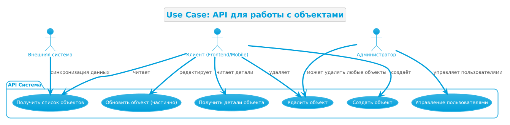

# Архитектурные диаграммы

Здесь собраны ключевые диаграммы системы. 

- Картинки (PNG) — для наглядности на сайте.
- Исходные коды диаграмм (PlantUML `.puml`) хранятся **внутри папки `docs/diagrams/plantuml`** специально для этого портфолио, 
чтобы можно было быстро посмотреть код прямо на сайте. В большом проекте я бы вынесла их в корень репозитория, но здесь это удобно для демонстрации.

## Use Case: Границы системы и акторы

Диаграмма показывает, кто взаимодействует с API и какие сценарии доступны.

*Исходный код этой диаграммы: [uc-01.puml](diagrams/plantuml/uc-01.puml)*