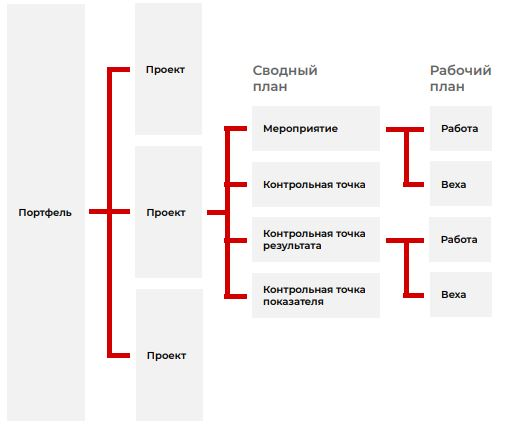

## Система управления проектами
### О системе

>Система СУП создана для управления проектом на всех этапах его
жизненного цикла: инициация, планирование,
реализация и контроль, завершение.

### Цели создания
- Обеспечение достижения стратегических целей
развития и запланированных целевых
показателей реализации проектов и программ
- Соблюдение и сокращение сроков достижения
результатов проектов и программ
- Соблюдение и экономия бюджетов проектов
и программ
- Повышение эффективности использования
ресурсов проектов и программ
- Обеспечение прозрачности, обоснованности
и своевременности принимаемых решений
- Повышение эффективности
внутриведомственного, межведомственного
и межуровневого взаимодействия

### Эффекты от создания

| Эффект 1 | Эффект 2 | Эффект 3
|--------------|--------------| --------------|
| Снижение затрат на разработку и оформление документации по проекту | Исключение несоответствия проектных документов друг другу | Обеспечение взаимосвязи данных и логического контроля|

### Структура проекта

